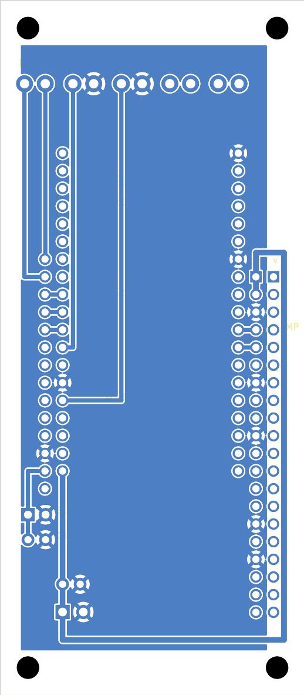

# Carrier / interconnect board — rev B (44 × 100 mm)

A single-sided PCB that holds the three modules of the Ericsson 1951 → 4G/VoLTE build
and breaks the phone's own parts out onto clearly-marked terminals. Sized as a **tall
strip, 44 × 100 mm**, to fit a **45 × 120 mm** mill bed.

| Ref | Part | Footprint |
|-----|------|-----------|
| U1 | **ESP32-DevKitC** (38-pin) | 2×19, rows **25.4 mm** apart, vertical |
| U2 | **Silvertel Ag1171 SLIC** | 14-pin SIL, vertical |
| U3 | **Waveshare A7670E Cat-1 HAT** (SKU 20049) | 2×20 RPi header, vertical |
| J1 | phone terminals | BELL · HOOK · DIAL · MIC · SPK (large pads) |
| J2 | PWR IN | 5V / GND |
| J3 | SLIC PWR | +VPWR (3.3–5 V) / GND |
| C1 | Ag1171 decoupling | ~100 µF electrolytic (+ 100 nF if you have room) |
| C2 | 5 V reservoir | ~1000 µF electrolytic (modem TX bursts) |

Modules solder onto male pins on **top**; all copper (traces + GND pour) is on the
**bottom** (B.Cu). Every net is routed in copper **except PWRKEY**, one wire jumper.

## Files

- `gerbers/carrier-gerbers.zip` — **send to the fab / load in your CAM** (Gerber + drill)
- `carrier.kicad_pcb` — editable KiCad 10 board · `gen_board.py` — regenerate it
- `carrier.png` — render · `drc.rpt` — design-rule report

## ⚠ Before you cut

1. **ESP32 row spacing** — built for **25.4 mm** (official DevKitC). Many clones are
   **22.86 mm**. Modules solder onto rigid pins, so measure yours with callipers; if 0.9″,
   set `ESP_ROW = 22.86` at the top of `gen_board.py` and re-run.
2. **PWRKEY jumper** — one bottom-side wire from the pad marked **JMP** (HAT pin 7) to the
   ESP32 **GPIO4** pad. The only required jumper.
3. **HAT orientation** — plug the A7670E HAT so its pin-1 corner matches the `pin2 v` mark
   (the even-pin / 5 V row is nearest the ESP32).

## Phone-side terminals (the large pads)

| Terminal | Pads | Goes to | Notes |
|----------|------|---------|-------|
| **BELL** | TIP, RING | Ag1171 TIP/RING | drives the twin-gong bells (via the phone's own 1MF cap block) |
| **HOOK** | SIG, GND | ESP32 **GPIO14** | hook switch to GND; firmware uses internal pull-up |
| **DIAL** | SIG, GND | ESP32 **GPIO13** | rotary pulse contacts to GND; internal pull-up |
| **MIC**  | 2 pads | modem mic | handset carbon mic — see audio note below |
| **SPK**  | 2 pads | modem earpiece | handset receiver — see audio note below |

HOOK/DIAL are wired **straight to GPIOs** here (simplest, matches the RESEARCH.md
"contacts to GPIO" route). If you'd rather sense them through the SLIC loop, wire them
into the BELL/line loop and read the Ag1171 **SHK** line (already on GPIO27) instead.

## Module interconnect (netlist)

| Net | ESP32 | A7670E HAT (Pi pin) | Ag1171 | On board |
|-----|-------|---------------------|--------|----------|
| GND | GND | 6,14,20,30,34 | 12 GNDPWR | **B.Cu pour** |
| 5V | 5V (VIN) | 2, 4 | — | copper |
| +VPWR | — | — | 13 | copper (from J3) |
| TX | GPIO17 | 8 (→modem RXD) | — | copper |
| RX | GPIO16 | 10 (←modem TXD) | — | copper |
| **PWRKEY** | GPIO4 | 7 | — | **wire jumper** |
| F/R · RM · SHK | GPIO25/26/27 | — | 3 / 4 / 5 | copper |
| PD | — | — | 14 | left open (normal run) |

## Do you need external components besides the modules? — Short answer: a few

Wiring the modules together is *not quite* enough. The genuinely-needed extras:

- **C1 — Ag1171 supply decoupling (on-board footprint).** The SLIC has an internal DC/DC
  that spikes when generating the ~60 V ring; it wants local bulk. Fit **~100 µF** across
  J3 (and a 100 nF ceramic if you can). Datasheet §5.
- **C2 — 5 V reservoir (on-board footprint).** The A7670E pulls ~1–2 A in LTE TX bursts;
  **≥1000 µF** near the 5 V feed stops the rail sagging and dropping the modem/ESP32.
- **Carbon-mic bias (off-board, situational).** The modem's mic input supplies an *electret*
  bias (~2 V, µA). A **carbon** capsule needs tens of mA — it won't work off that. Options:
  a series bias resistor to 5 V + DC-block cap into the mic input, **or** hide an electret
  (which the modem biases directly) inside the original capsule. See RESEARCH.md.
- **Audio coupling (off-board, situational).** If you route call audio *through* the SLIC
  (Ag1171 VIN/VOUT ↔ modem) you need 10 nF (VIN) / 100 nF (VOUT). If you use the HAT's
  3.5 mm jack (the default architecture — MIC/SPK terminals wire to the jack), the HAT
  already has its coupling and you don't.
- **TIP/RING ESD clamp (off-board, optional).** On-premise use needs only light ESD
  protection (datasheet §4); recommended but not required for the bench.

Not needed: GPIO pull-ups (chose pull-up-capable pins), extra USB-C/CC resistors (those
live on your charge module feeding PWR IN), or a boost — **except** note that the HAT wants
**5 V**, so a 1S pack needs a boost to 5 V into PWR IN (this revises the "modem on raw VBAT"
note in the top-level CLAUDE.md, which was for a bare SIMCom module).

### Audio path (how MIC/SPK connect)

The A7670E's audio is on its **3.5 mm jack**, not the 40-pin header — so it can't reach the
handset through the board's module connector. Run a short 3.5 mm (TRRS) pigtail from the HAT
jack to the **MIC** and **SPK** terminals (or wire the HAT's MIC±/EAR± solder pads). Those
terminals are the handset's landing point; the modem side is your pigtail.

## Fab / mill settings

- 1 copper layer (bottom). Min trace/gap: 0.6 / 0.2 mm — trivial for a mill or any fab.
- Drills: 1.0 (module pins), 1.1 (SLIC term), 1.2 (power term), 1.3 (transducer pads),
  3.2 mm NPTH (4× M3). Board 44 × 100 mm.

## Known DRC items (expected)

- **1 error** — `unconnected PWRKEY`: the intentional jumper, not a fault.
- warnings — `silk over copper` / one isolated pour sliver: harmless on a poured 1-layer board.
</content>
</invoke>
